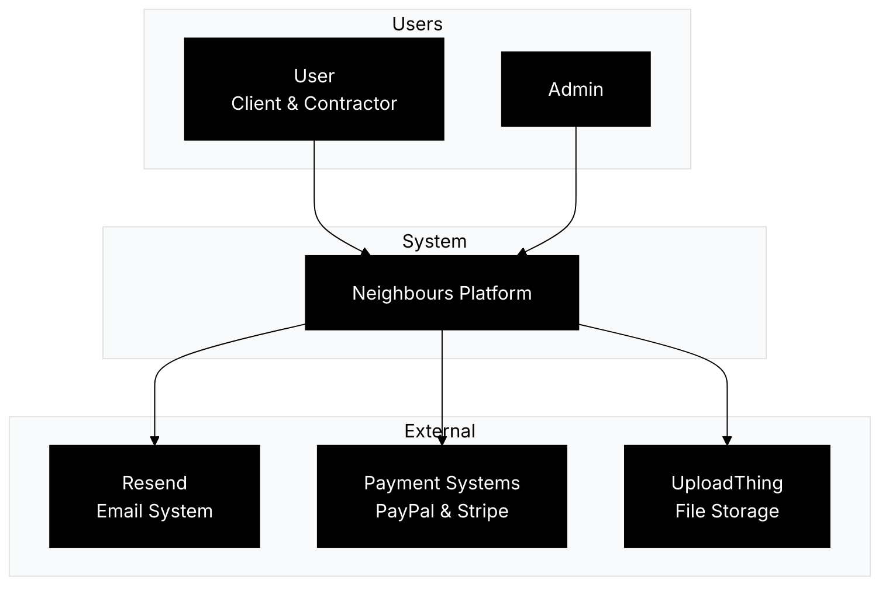
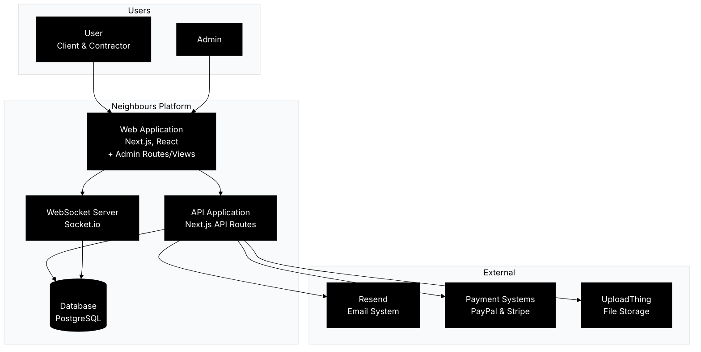
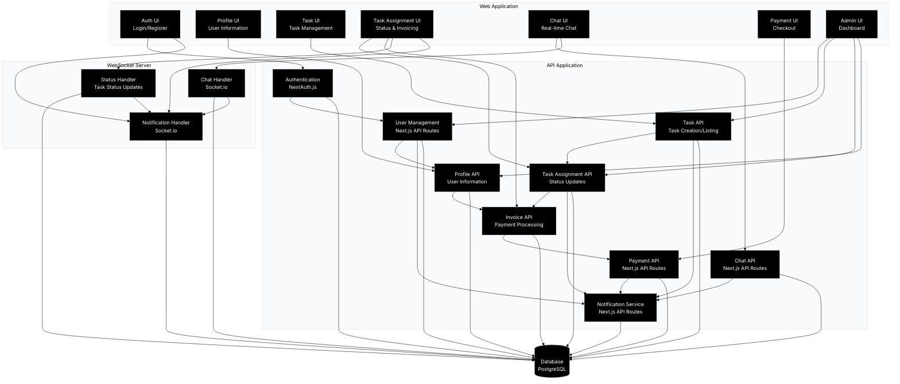
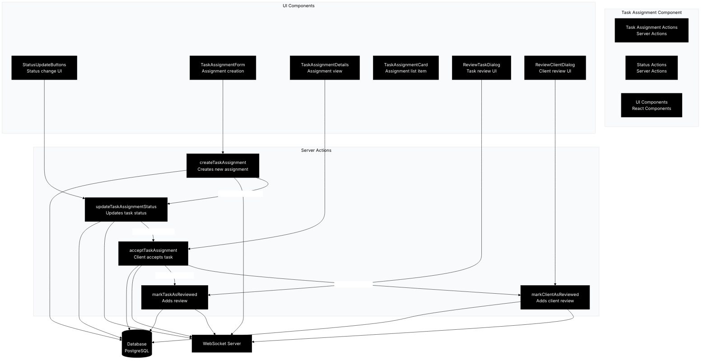

# C4 Model Architecture

## Level 1: System Context Diagram

## Level 2: Container Diagram

## Level 3: Component Diagram

## Level 4: Code Diagram (Task Assignment Component)

## Key Features by Component

### Web Application
- User interface for clients/contractors
- Admin interface (routes/views)
- Profile management
- Task creation and management
- Task assignment and status tracking
- Invoice generation and payment
- Real-time chat interface
- Payment processing interface

### API Application
- Authentication and authorization
- User and role management
- Profile management
- Task management and assignment
- Invoice generation and processing
- Chat functionality
- Payment processing
- Notification system

### WebSocket Server
- Real-time chat
- Task status updates
- Real-time notifications

### Database
- User data and roles
- Profile information
- Task data and assignments
- Invoice data
- Chat messages
- Payment transactions
- Reviews and ratings
