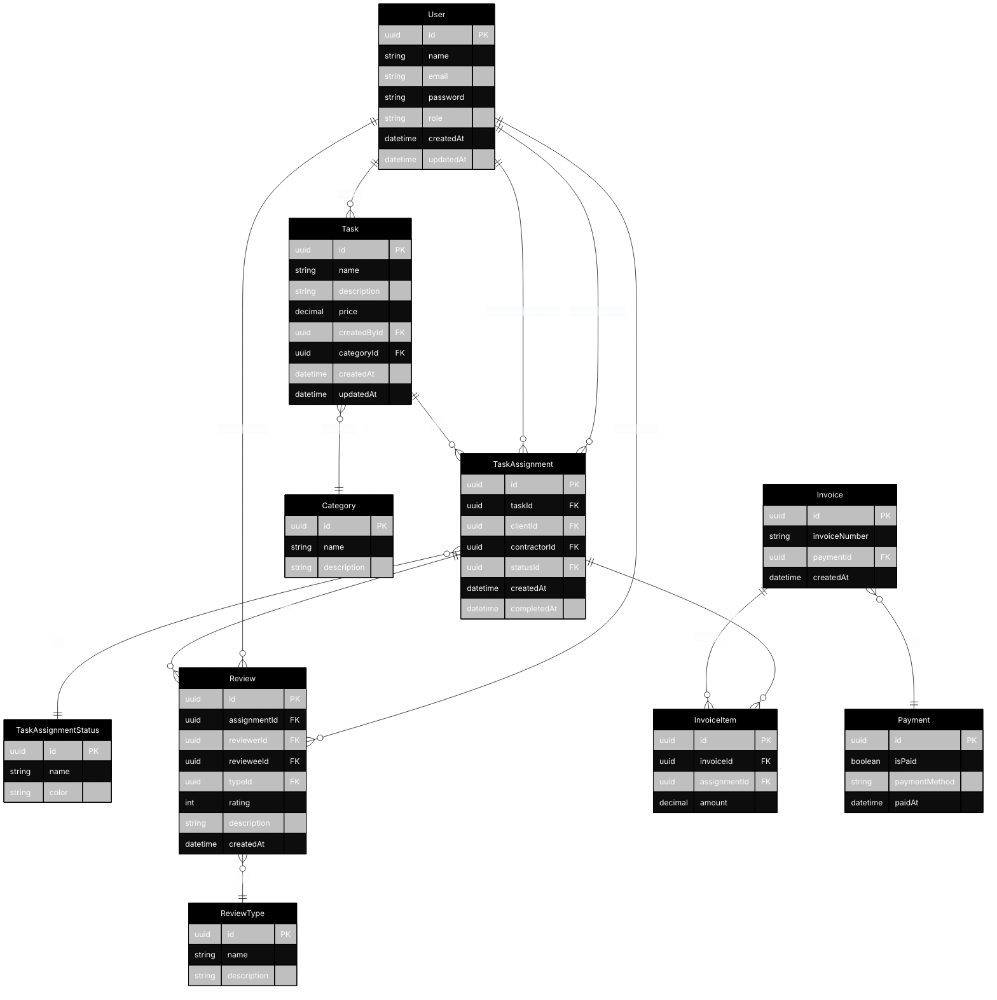

# Database Schema

## Entity Relationship Diagram

## Key Relationships

1. **User Relationships**
   - Users can create multiple tasks
   - Users can be clients or contractors in task assignments
   - Users can leave and receive reviews

2. **Task Relationships**
   - Tasks belong to a category
   - Tasks can have multiple assignments
   - Tasks are created by users

3. **Task Assignment Relationships**
   - Assignments have a status
   - Assignments can have reviews
   - Assignments can have invoice items

4. **Review Relationships**
   - Reviews are associated with task assignments
   - Reviews have a type (Client Review or Contractor Review)
   - Reviews connect reviewers and reviewees

5. **Invoice Relationships**
   - Invoices contain multiple invoice items
   - Invoices are linked to payments
   - Invoice items are linked to task assignments

## Status Flow

Task assignments go through the following statuses:
1. IN_PROGRESS - When task is assigned
2. COMPLETED - When contractor marks task as done
3. ACCEPTED - When client accepts completed task

## Review Types

1. Client Review - Review from client to contractor
2. Contractor Review - Review from contractor to client
